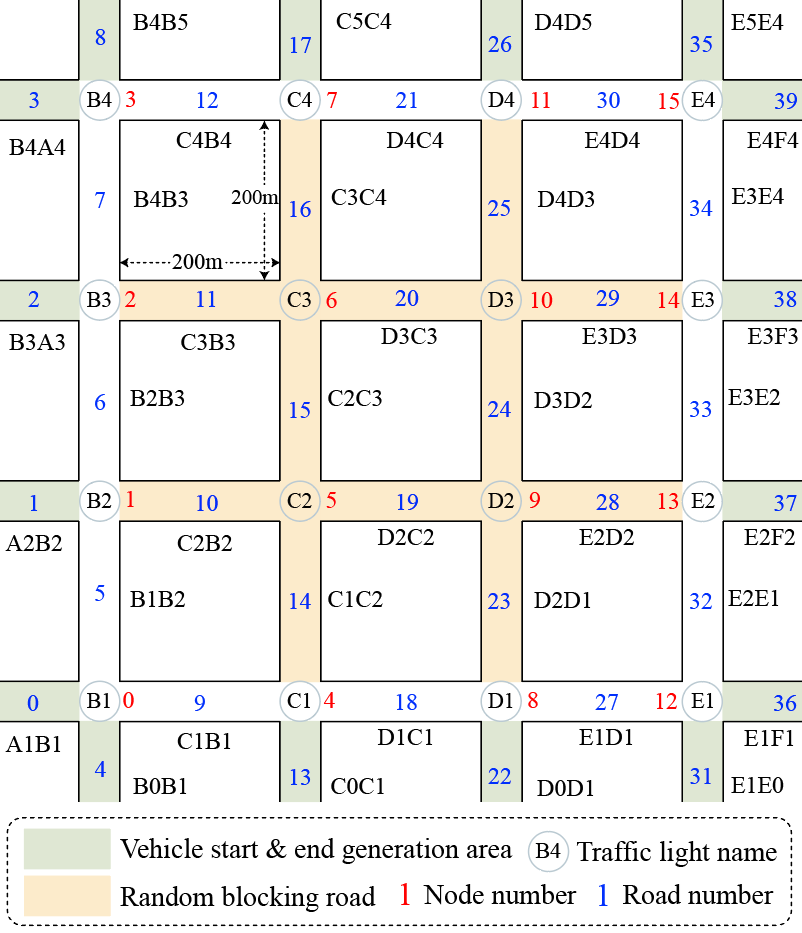

# MacLight Configuration

## Package Requirements

Python 3.8, torch, numpy, pandas, tqdm, eclipse-sumo, traci, libsumo, sumo-rl

Except for torch, the other packages can be installed by running the commands in the `install.sh` script. Torch needs to be installed separately.

## Environment Setup

1. Use `conda` to create a virtual environment, specifying `python=3.8`. Let's assume the environment name is `your_env`.

2. Install torch following the instructions on the official Torch website.

3. Use `conda` or `pip` to install is ok for
   
   ```ssh
   pip install eclipse-sumo
   pip install traci
   pip install libsumo
   pip install sumo-rl
   pip install gymnasium
   pip install pettingzoo
   ```

4. Set the SUMO path. On Linux:
   
   ```bash
   export SUMO_HOME=miniconda3/envs/{your_env}/lib/{python3.8}/site-packages/sumo
   ```
   
   (Where `miniconda` might be `anaconda`). On Windows, set an environment variable pointing to the SUMO folder.

## Run MacLight

To run MacLight:

```bash
python run_Ours.py -w 1 -t block -l normal
```

After the execution is complete, the data will be saved in the `data/plot_data/` folder.

# Dynamic Traffic Flow Construction Guide

## Block Environment Code

Refer to the file `env\wrap\random_block.py`.

## Simulation Environment Creation

After installing SUMO and configuring its environment variables, you can create the simulation environment.

1. Use the following command to create a simple road network:
   
   ```bash
   netgenerate --grid --grid.number=6 --grid.length=200 --default.lanenumber=6 -o ff.net.xml
   ```
2. In `netedit`, manually delete the surrounding roads and the corner nodes.
3. Create traffic lights:
   
   ```bash
   netconvert --sumo-net-file ff.net.xml --tls.guess --output-file ff.net.xml
   ```
4. Delete the left-turn and straight signals for the left lanes of the traffic lights.
5. Modify the traffic light phases in the `ff.net.xml` file (do not use the default phases) by locating the `</tlLogic>` tag and adjusting all traffic light phases to:
   
   ```xml
   <phase duration="30" state="grrrgGGrgrrrgGGr"/>
   <phase duration="3"  state="grrrgGGrgrrrgyyr"/>
   <phase duration="15" state="grrrgGGGgrrrgrrr"/>
   <phase duration="3"  state="grrrgyyygrrrgrrr"/>
   <phase duration="15" state="grrrgrrrgrrrgGGG"/>
   <phase duration="3"  state="grrrgrrrgrrrgyyG"/>
   <phase duration="15" state="grrrgrrGgrrrgrrG"/>
   <phase duration="3"  state="grrrgrrygrrrgrry"/>
   <phase duration="30" state="gGGrgrrrgGGrgrrr"/>
   <phase duration="3"  state="gyyrgrrrgGGrgrrr"/>
   <phase duration="15" state="grrrgrrrgGGGgrrr"/>
   <phase duration="3"  state="grrrgrrrgyyygrrr"/>
   ```

## Vehicle ID: 0–8999

To get the list of vehicle IDs currently operating in the system:

```python
traci.vehicle.getIDList()
```

To reroute based on travel time:

```python
traci.vehicle.rerouteTraveltime(vehicle_id)
```

## Map



## Blocking Roads

To block a road by reducing its speed limit:

```python
traci.edge.setMaxSpeed(edge, 1)
```

## ID List of All Lanes

```python
['A1B1', 'A2B2', 'A3B3', 'A4B4',
 'B0B1', 'B1A1', 'B1B0', 'B1B2',
 'B1C1', 'B2A2', 'B2B1', 'B2B3',
 'B2C2', 'B3A3', 'B3B2', 'B3B4',
 'B3C3', 'B4A4', 'B4B3', 'B4B5',
 'B4C4', 'B5B4', 'C0C1', 'C1B1',
 'C1C0', 'C1C2', 'C1D1', 'C2B2',
 'C2C1', 'C2C3', 'C2D2', 'C3B3',
 'C3C2', 'C3C4', 'C3D3', 'C4B4',
 'C4C3', 'C4C5', 'C4D4', 'C5C4',
 'D0D1', 'D1C1', 'D1D0', 'D1D2',
 'D1E1', 'D2C2', 'D2D1', 'D2D3',
 'D2E2', 'D3C3', 'D3D2', 'D3D4',
 'D3E3', 'D4C4', 'D4D3', 'D4D5',
 'D4E4', 'D5D4', 'E0E1', 'E1D1',
 'E1E0', 'E1E2', 'E1F1', 'E2D2',
 'E2E1', 'E2E3', 'E2F2', 'E3D3',
 'E3E2', 'E3E4', 'E3F3', 'E4D4',
 'E4E3', 'E4E5', 'E4F4', 'E5E4',
 'F1E1', 'F2E2', 'F3E3', 'F4E4']
```

## Restricting the Central Area as a Starting Point

Refer to the `ff.dst.xml` and `ff.src.xml` files to ensure that roads in the central area are not used as starting points. Use the corresponding parameter when generating trips with `randomTrips.py`: `--weights-prefix ff` (no suffix is required).

Allowed starting edges:

```python
["A1B1", "B1A1", "A2B2", "B2A2", "A3B3",
"B3A3", "B4A4", "A4B4", "E1F1", "F1E1",
"E4F4", "F4E4", "E2F2", "F2E2", "E3F3",
"F3E3", "B1B0", "B0B1", "C1C0", "C0C1",
"D1D0", "D0D1", "E1E0", "E0E1", "B5B4",
"B4B5", "C5C4", "C4C5", "D5D4", "D4D5",
"E5E4", "E4E5"]
```

Prohibited starting edges:

```python
['B1B2', 'B1C1', 'B2B1', 'B2B3', 'B2C2',
 'B3B2', 'B3B4', 'B3C3', 'B4B3', 'B4B5',
 'B4C4', 'B5B4', 'C1B1', 'C1C2', 'C1D1',
 'C2B2', 'C2C1', 'C2C3', 'C2D2', 'C3B3',
 'C3C2', 'C3C4', 'C3D3', 'C4B4', 'C4C3',
 'C4D4', 'D1C1', 'D1D2', 'D1E1', 'D2C2',
 'D2D1', 'D2D3', 'D2E2', 'D3C3', 'D3D2',
 'D3D4', 'D3E3', 'D4C4', 'D4D3', 'D4E4',
 'E1D1', 'E1E2', 'E2D2', 'E2E1', 'E2E3',
 'E3D3', 'E3E2', 'E3E4', 'E4D4', 'E4E3']
```

These edges may be blocked, so they cannot be set as start or end points.


